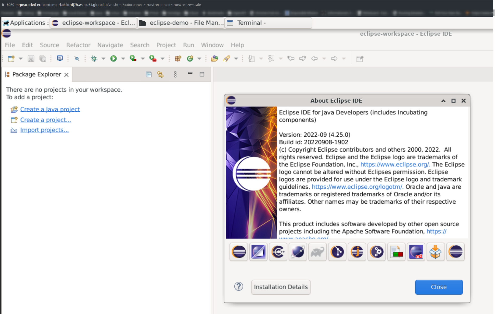

# Eclipse im Browser

Diese Repository ist eine Demonstration wie die Eclipse IDE im Browser in der KBK genutzt werden kann, um dort z.B. Projekte im EAI Umfeld zu realisieren.

Insgesamt startet der Workspace mit dem Download und dem Starten von Eclipse in unter einer Minute.

